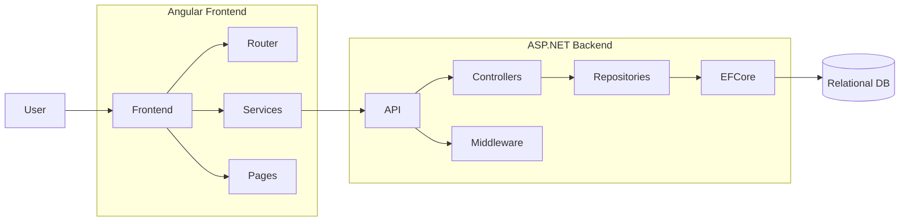
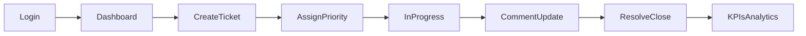
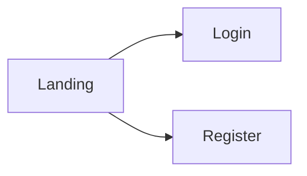
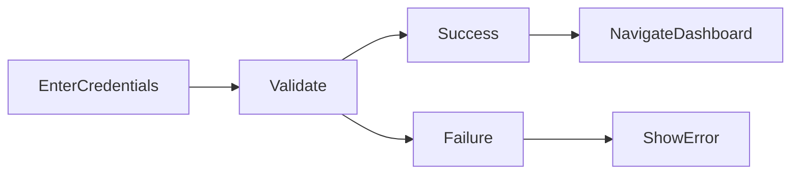
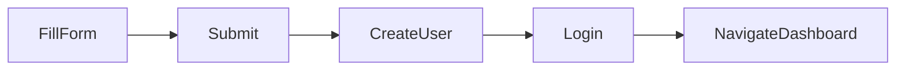
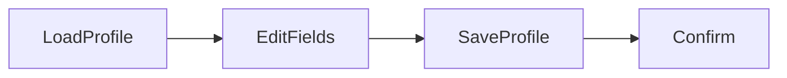
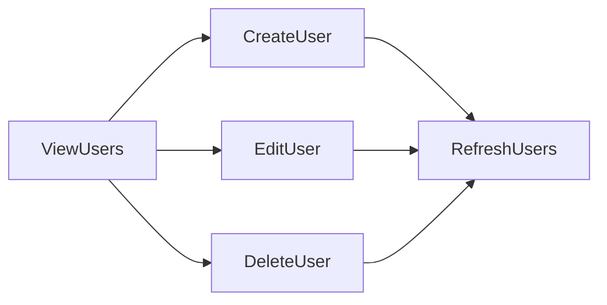
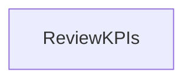

# Issue Tracking App

A full‑stack issue tracking system with a .NET 9 Web API backend and an Angular 20 frontend. It supports authentication, ticket lifecycle management, KPIs/analytics, and role‑based access.

## Combined Architecture (Frontend + Backend)

The app is split into two deployable units: `backend/IssueTrackingAPI` and `frontend/IssueTrackingFrontend`. Data persists in a relational database via Entity Framework Core.



## User Interaction Workflow



## Page Workflows

### Landing



### Login



### Register



### Dashboard → Profile



### Dashboard → Users (Admin)



### Dashboard → Analytics (Admin)



## Tech Stack

- Backend: .NET 9, ASP.NET Core, EF Core, SQL (migrations in `Migrations/`)
- Frontend: Angular 20, TypeScript, Tailwind CSS
- Auth: JWT Token

## Monorepo Structure

```text
backend/
  IssueTrackingAPI/      # Web API
  IssueTrackingTest/     # Tests
frontend/
  IssueTrackingFrontend/ # Angular app
```

## Getting Started

### Prerequisites

- Node 20+, NPM
- .NET SDK 9.0
- SSMS SQL database server

### Backend

1. Update connection string in `backend/IssueTrackingAPI/appsettings.json`.
2. Apply migrations and run:
   - `dotnet ef database update`
   - `dotnet run --project backend/IssueTrackingAPI`

API will listen on the configured port (see `Properties/launchSettings.json`).

### Frontend

1. Install dependencies: `cd frontend/IssueTrackingFrontend && npm install`
2. Configure API base URL in `src/env/env.ts` if needed.
3. Start dev server: `ng serve`

### Environment Variables

- Backend: connection string, JWT key, CORS origins
- Frontend: API base URL

## Workflows & Roles

- Roles: Admin, Manager, Agent, Reporter
- Ticket lifecycle: New → Assigned → In Progress → Resolved → Closed
