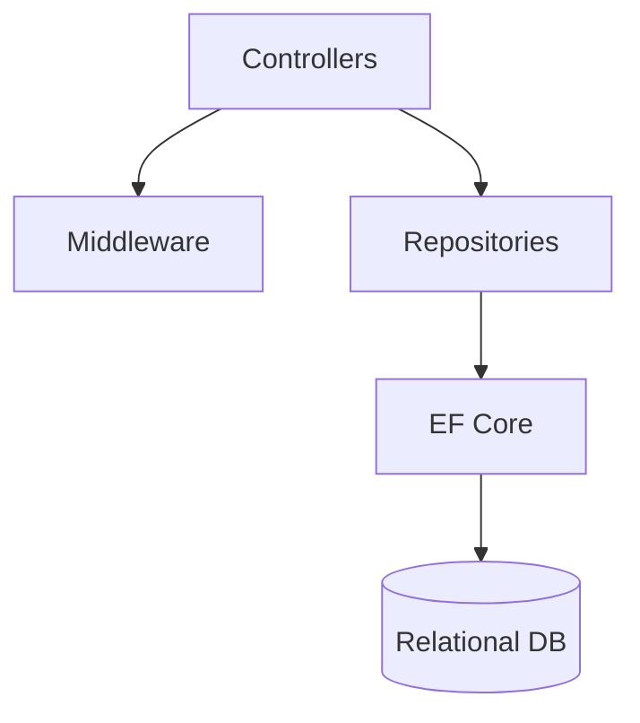
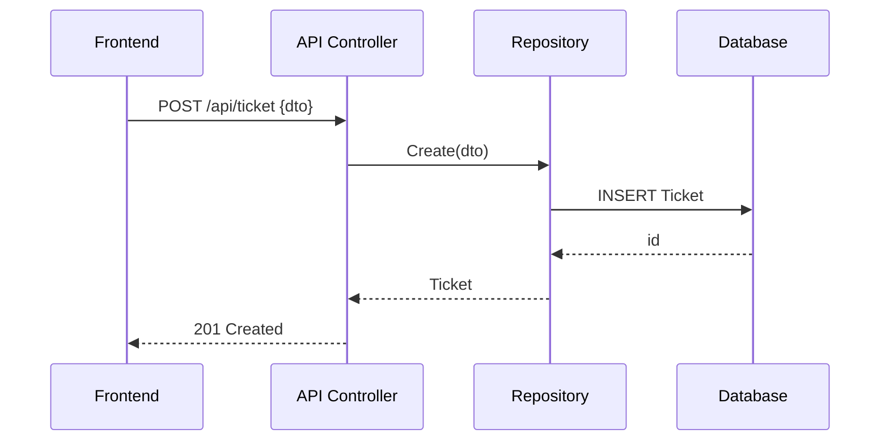
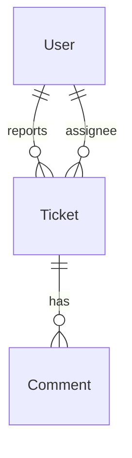

# Issue Tracking - Backend (ASP.NET Core 9)

ASP.NET Core (.NET 8) Web API providing authentication, ticket management, dashboard KPIs, and user administration. Uses Entity Framework Core for data access and migrations.

## High-Level Architecture

Key folders:

- `Controllers/` HTTP endpoints (Auth, Ticket, KPI, Dashboard, User)
- `Repository/` business/data layer (interfaces and implementations)
- `Context/` EF Core `AppDBContext`
- `Model/` entity models
- `DTO/` request/response contracts
- `Middleware/` cross-cutting concerns

## Request Workflow (Create Ticket)

## Data Model (Simplified)

Actual schema is defined in `Model/` and migrations in `Migrations/`.

## API Endpoints by Role

Sourced from controllers in `backend/IssueTrackingAPI/Controllers`.

### Anonymous/Public

| Method | Endpoint             | Notes                     |
| ------ | -------------------- | ------------------------- |
| POST   | `/api/auth/login`    | Login                     |
| POST   | `/api/auth/register` | Register (AuthController) |
| POST   | `/api/user`          | Register (UserController) |

### Authenticated (any role)

| Method | Endpoint                       | Notes                                 |
| ------ | ------------------------------ | ------------------------------------- |
| GET    | `/api/user/{id}`               | View own profile (Admin can view any) |
| PUT    | `/api/user/{id}`               | Update own profile (Admin any)        |
| PUT    | `/api/user/{id}/password`      | Update password                       |
| GET    | `/api/user/representatives`    | List representatives                  |
| GET    | `/api/ticket`                  | Role-filtered list                    |
| GET    | `/api/ticket/search`           | Search with filters/pagination        |
| GET    | `/api/ticket/{id}`             | View ticket                           |
| PUT    | `/api/ticket/{id}`             | Update (role restrictions apply)      |
| GET    | `/api/kpi/representative/{id}` | Own KPI (or Admin any)                |

### User

| Method | Endpoint           | Notes              |
| ------ | ------------------ | ------------------ |
| POST   | `/api/ticket`      | Create ticket      |
| PUT    | `/api/ticket/{id}` | Update own tickets |

### Rep

| Method | Endpoint                   | Notes                                 |
| ------ | -------------------------- | ------------------------------------- |
| PUT    | `/api/ticket/{id}`         | Update assigned or unassigned tickets |
| PUT    | `/api/ticket/{id}/comment` | Comment on assigned/unassigned        |

### Admin

| Method | Endpoint                           | Notes               |
| ------ | ---------------------------------- | ------------------- |
| GET    | `/api/user`                        | List users          |
| DELETE | `/api/user/{id}`                   | Delete user         |
| DELETE | `/api/ticket/{id}`                 | Delete ticket       |
| GET    | `/api/dashboard/stats`             | Dashboard stats     |
| GET    | `/api/dashboard/trends`            | Ticket trends       |
| GET    | `/api/dashboard/performance`       | Rep performance     |
| GET    | `/api/kpi/representatives`         | All reps KPI        |
| GET    | `/api/kpi/average-resolution-time` | Avg resolution time |
| GET    | `/api/kpi/total-resolved`          | Total resolved      |

## Running Locally

1. Configure connection string and JWT in `appsettings.json`.
2. Apply migrations: `dotnet ef database update`.
3. Run API: `dotnet run --project IssueTrackingAPI`.

## Testing

- Unit tests in `../IssueTrackingTest`.
- Run: `dotnet test backend/IssueTrackingTest`.

## Notes

- CORS, exception handling, and dependency injection configured in `Program.cs` and `Middleware/`.
- Repositories expose interfaces for testability.
