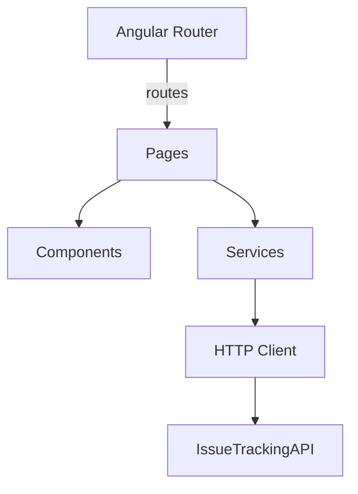
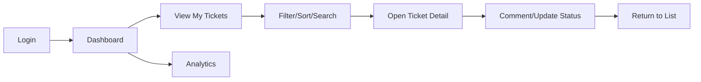

# Issue Tracking - Frontend (Angular 20)

Angular 20 SPA that consumes the Issue Tracking API and provides dashboards, ticket management, and analytics.

## App Architecture



Key areas:

- Pages under `src/app/pages` for features (dashboard, tickets, analytics)
- Services under `src/app/core/services` for API calls and state
- Models under `src/app/models` for DTOs/interfaces

## User Workflow (Frontend)



## Frontend Routes

Frontend routing map (from `frontend/IssueTrackingFrontend/src/app/app.routes.ts`):

| Path                   | Component       | Guards      | Roles         |
| ---------------------- | --------------- | ----------- | ------------- |
| `/`                    | `Landing`       | -           | -             |
| `/login`               | `Login`         | -           | -             |
| `/register`            | `Register`      | -           | -             |
| `/dashboard`           | `Dashboard`     | `authGuard` | Authenticated |
| `/dashboard/tickets`   | `Tickets`       | inherits    | Authenticated |
| `/dashboard/profile`   | `Profile`       | inherits    | Authenticated |
| `/dashboard/users`     | `Users`         | `roleGuard` | Admin         |
| `/dashboard/analytics` | `Analytics`     | `roleGuard` | Admin         |
| `**`                   | redirect to `/` | -           | -             |

## Environment

- Configure API base in `src/env/env.ts`.
- Interceptors for auth in `src/app/core/interceptors`.

## Development

```bash
ng serve
```

## Build

```bash
ng build
```

Artifacts in `dist/` can be served via any static server.
